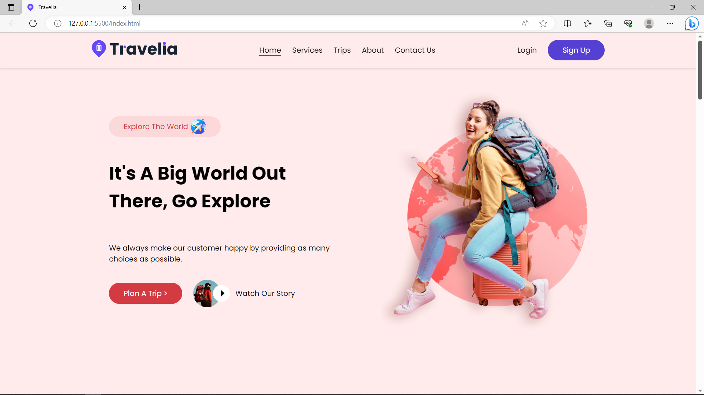

# Travel webpage

## Overview

### Screenshot

### Links

- Live Site URL: https://mohammad-shaar.github.io/Travel-web-page/

## My process

### Built with

- Semantic HTML5 markup
- CSS custom properties
- Flexbox
- Grid
- JS

### What I learned

- In this project I practice how to build a webpage with flex and grid.
- I lernd how to make the webpage fully responsiv.
- And I learned how to manipulate the DOM using JS.
